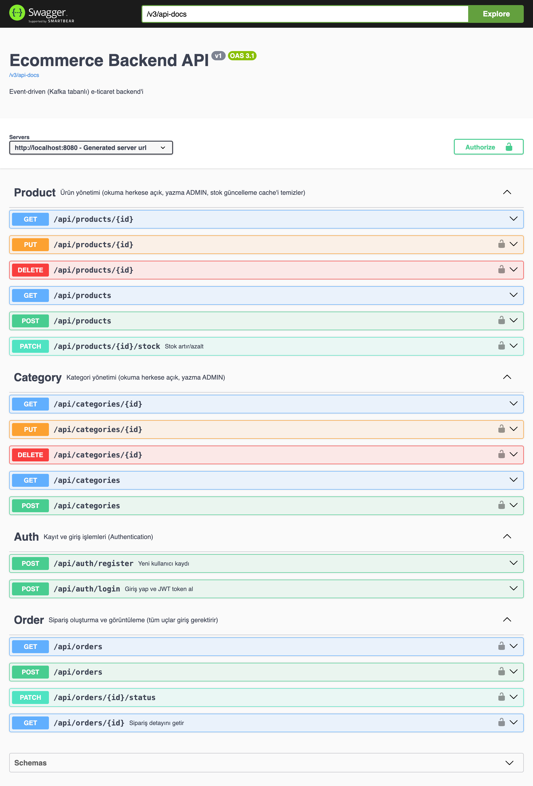

# 🛒 ecommerce-backend

> Event-driven, production-kalitesinde bir e-ticaret backend'i. Sipariş akışı Kafka
> üzerinden yönetilir; ürün listeleri Redis ile cache'lenir; kimlik doğrulama JWT ile yapılır.

[](https://openjdk.org/)
[](https://spring.io/projects/spring-boot)
[](https://www.postgresql.org/)
[](https://redis.io/)
[](https://kafka.apache.org/)
[](https://www.docker.com/)
[](https://github.com/features/actions)
[](https://swagger.io/)

---

## 📖 Ne Yapıyor?

`ecommerce-backend`, kullanıcı kaydı/girişi, ürün kataloğu, sipariş oluşturma ve
sipariş sonrası asenkron iş akışlarını (düşük stok izleme, sipariş bildirimi)
event-driven bir mimariyle yöneten bir REST API'dir. Sipariş oluşturulduğunda
veritabanı transaction'ı gerçekten commit olduktan sonra bir Kafka event'i
fırlatılır; iki bağımsız consumer bu event'i kendi tüketici grubuyla okur.

## 🏗️ Mimari

```
                     ┌──────────────┐
                     │    Client    │
                     └──────┬───────┘
                            │ REST (JWT)
                            ▼
                  ┌───────────────────┐
                  │   Spring Boot API │
                  │ (Auth/Category/   │
                  │  Product/Order)   │
                  └───┬───────┬───────┘
                      │       │
           ┌──────────┘       └──────────┐
           ▼                             ▼
   ┌───────────────┐             ┌───────────────┐
   │  PostgreSQL    │             │     Redis      │
   │ (kalıcı veri)  │             │  (ürün cache)  │
   └───────────────┘             └───────────────┘
           │
           │ commit sonrası: OrderCreatedEvent
           ▼
   ┌───────────────────┐
   │       Kafka        │
   │   (order-events)   │
   └──────┬─────┬───────┘
          │     │
          ▼     ▼
   ┌──────────────┐ ┌──────────────┐
   │ StockMonitor  │ │ Notification  │
   │  Consumer     │ │  Consumer     │
   │ (düşük stok   │ │ (sipariş      │
   │  uyarısı)     │ │  onay logu)   │
   └──────────────┘ └──────────────┘
```

Sipariş anındaki stok düşümü **senkron** yapılır (kullanıcı yetersiz stok bilgisini
anında almalı); Kafka consumer'ları stoğa dokunmaz, yalnızca sipariş sonrası
durumu izler/bildirir.

## 🧰 Teknolojiler

- **Java 21** + **Spring Boot 4.1** — uygulama çatısı
- **PostgreSQL** — ana veritabanı (Spring Data JPA/Hibernate)
- **Redis** — ürün/ürün listesi cache
- **Kafka** (KRaft modu) — event-driven sipariş akışı (producer + retry/DLT'li consumer'lar)
- **Spring Security + JWT** — stateless authentication/authorization
- **Docker + Docker Compose** — yerel geliştirme ve tüm servislerin (uygulama dahil) çalıştırılması
- **GitHub Actions** — push/PR'da otomatik build+test CI pipeline'ı
- **springdoc-openapi (Swagger UI)** — interaktif API dokümantasyonu
- **Spring Boot Actuator** — `/actuator/health` health check endpoint'i
- **MapStruct + Lombok** — DTO mapping ve boilerplate azaltma

## 🚀 Kurulum

```bash
git clone https://github.com/yusufguc/ecommerce-backend.git
cd ecommerce-backend
cp .env.example .env   # kendi değerlerinizi girin (özellikle JWT_SECRET)
```

```bash
docker compose up -d --build
```

Uygulama ayağa kalktığında:
- API: `http://localhost:8080`
- Swagger UI: `http://localhost:8080/swagger-ui/index.html`
- Health check: `http://localhost:8080/actuator/health`
- Kafka UI: `http://localhost:8090`

## 📡 API Endpoints

| Method | Endpoint                     | Açıklama                              | Auth        |
|--------|-------------------------------|----------------------------------------|-------------|
| POST   | `/api/auth/register`          | Yeni kullanıcı kaydı                  | ❌          |
| POST   | `/api/auth/login`             | Giriş, JWT üretimi                    | ❌          |
| GET    | `/api/categories`              | Kategori listesi                      | ❌          |
| GET    | `/api/categories/{id}`         | Kategori detayı                       | ❌          |
| POST   | `/api/categories`               | Kategori oluştur                      | ✅ ADMIN    |
| PUT    | `/api/categories/{id}`          | Kategori güncelle                     | ✅ ADMIN    |
| DELETE | `/api/categories/{id}`          | Kategori sil                          | ✅ ADMIN    |
| GET    | `/api/products`                | Ürün listesi (sayfalı, filtreli, cache'li) | ❌     |
| GET    | `/api/products/{id}`           | Ürün detayı (cache'li)                | ❌          |
| POST   | `/api/products`                 | Ürün oluştur                          | ✅ ADMIN    |
| PUT    | `/api/products/{id}`            | Ürün güncelle                         | ✅ ADMIN    |
| DELETE | `/api/products/{id}`            | Ürün sil                              | ✅ ADMIN    |
| PATCH  | `/api/products/{id}/stock`      | Stok artır/azalt                      | ✅ ADMIN    |
| POST   | `/api/orders`                   | Sipariş oluştur (stok kontrolü + Kafka event) | ✅  |
| GET    | `/api/orders`                   | Kendi siparişlerim (sayfalı)           | ✅          |
| GET    | `/api/orders/{id}`              | Sipariş detayı (sahiplik kontrollü)    | ✅          |
| PATCH  | `/api/orders/{id}/status`        | Sipariş durumu güncelle                | ✅ ADMIN    |

Tüm endpoint'lerin güncel, interaktif dokümantasyonu için uygulama ayaktayken
**Swagger UI**'ı (`/swagger-ui/index.html`) kullanın — "Authorize" butonuna
login'den dönen token'ı girerek korumalı endpoint'leri doğrudan tarayıcıdan deneyebilirsiniz.

## 📸 Ekran Görüntüleri



## 📄 Lisans

MIT
