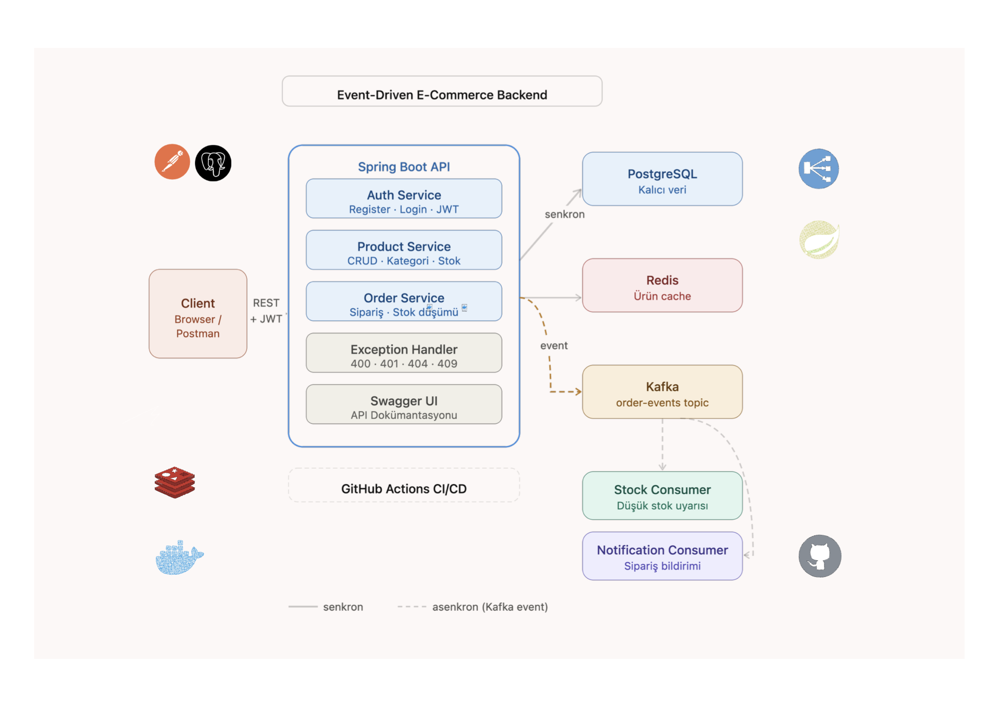
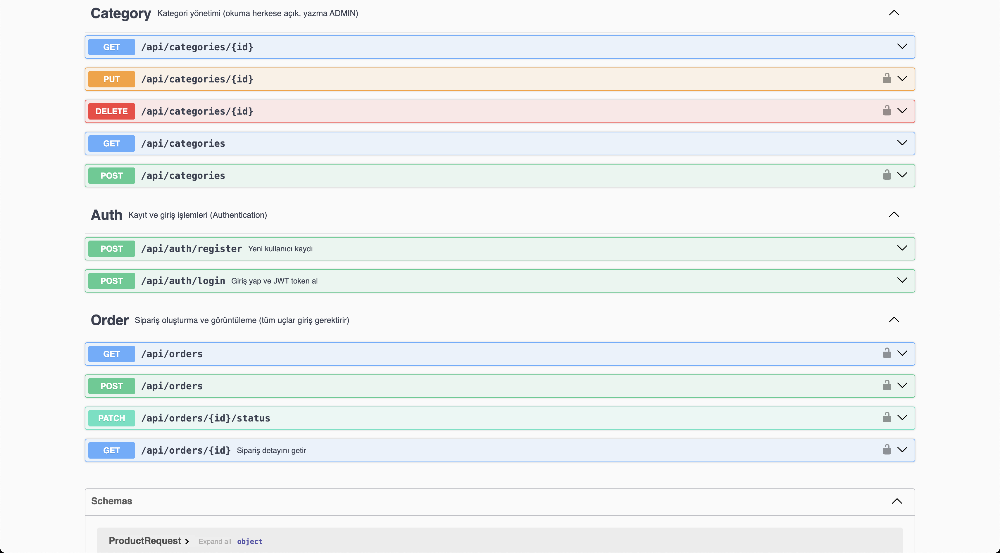

# 🛒 ecommerce-backend



> An event-driven e-commerce backend built from scratch to learn Kafka, Redis,
> and Docker. The order flow is managed via Kafka; product listings are
> cached with Redis; authentication is handled with JWT. I worked through
> each topic (from Docker Compose to Kafka consumers) by learning it first
> and then applying it, testing step by step against a real Docker Compose
> stack.

[](https://openjdk.org/)
[](https://spring.io/projects/spring-boot)
[](https://www.postgresql.org/)
[](https://redis.io/)
[](https://kafka.apache.org/)
[](https://www.docker.com/)
[](https://github.com/features/actions)
[](https://swagger.io/)

---

## 📖 What Does It Do?

`ecommerce-backend` is a REST API that manages user registration/login,
product catalog, order creation, and the asynchronous post-order workflows
(low-stock monitoring, order notifications) through an event-driven
architecture. When an order is created, a Kafka event is fired only after
the database transaction actually commits; two independent consumers read
this event, each with its own consumer group.

This project is the product of a learning process: I learned Kafka, Redis,
and Docker through building it. So it's not just "it works" — the real
issues I found and fixed along the way (N+1 queries, cache/consumer group
bugs, missing environment variables) haven't been deliberately hidden either
— they're all still in the commit history.

## 🧰 Technologies

- **Java 21** + **Spring Boot 4.1** — application framework
- **PostgreSQL** — primary database (Spring Data JPA/Hibernate)
- **Redis** — product/product list cache
- **Kafka** (KRaft mode) — event-driven order flow (producer + consumers with retry/DLT)
- **Spring Security + JWT** — stateless authentication/authorization, refresh token rotation, IP-based rate limiting (bucket4j)
- **Docker + Docker Compose** — local development and running all services (including the app)
- **GitHub Actions** — automated build+test CI pipeline on push/PR
- **springdoc-openapi (Swagger UI)** — interactive API documentation
- **Spring Boot Actuator** — `/actuator/health` health check endpoint
- **MapStruct + Lombok** — DTO mapping and boilerplate reduction

## 🚀 Setup

```bash
git clone https://github.com/yusufguc/ecommerce-backend.git
cd ecommerce-backend
cp .env.example .env   # fill in your own values (especially JWT_SECRET)
```

```bash
docker compose up -d --build
```

Once the application is up:
- API: `http://localhost:8080`
- Swagger UI: `http://localhost:8080/swagger-ui/index.html`
- Health check: `http://localhost:8080/actuator/health`
- Kafka UI: `http://localhost:8090`

## 📡 API Endpoints

| Method | Endpoint                     | Description                            | Auth        |
|--------|-------------------------------|----------------------------------------|-------------|
| POST   | `/api/auth/register`          | Register a new user                   | ❌          |
| POST   | `/api/auth/login`             | Log in, issue access+refresh tokens   | ❌          |
| POST   | `/api/auth/refresh`           | Refresh the access token (refresh rotation) | ❌       |
| POST   | `/api/auth/logout`            | Revoke the refresh token              | ❌          |
| GET    | `/api/categories`              | List categories                       | ❌          |
| GET    | `/api/categories/{id}`         | Category detail                       | ❌          |
| POST   | `/api/categories`               | Create category                       | ✅ ADMIN    |
| PUT    | `/api/categories/{id}`          | Update category                       | ✅ ADMIN    |
| DELETE | `/api/categories/{id}`          | Delete category                       | ✅ ADMIN    |
| GET    | `/api/products`                | List products (paginated, filterable, cached) | ❌     |
| GET    | `/api/products/{id}`           | Product detail (cached)               | ❌          |
| POST   | `/api/products`                 | Create product                        | ✅ ADMIN    |
| PUT    | `/api/products/{id}`            | Update product                        | ✅ ADMIN    |
| DELETE | `/api/products/{id}`            | Delete product                        | ✅ ADMIN    |
| PATCH  | `/api/products/{id}/stock`      | Increase/decrease stock               | ✅ ADMIN    |
| POST   | `/api/orders`                   | Create order (stock check + Kafka event) | ✅  |
| GET    | `/api/orders`                   | My own orders (paginated)              | ✅          |
| GET    | `/api/orders/{id}`              | Order detail (ownership-checked)       | ✅          |
| PATCH  | `/api/orders/{id}/status`        | Update order status                    | ✅ ADMIN    |

For up-to-date, interactive documentation of all endpoints, use
**Swagger UI** (`/swagger-ui/index.html`) while the app is running.


